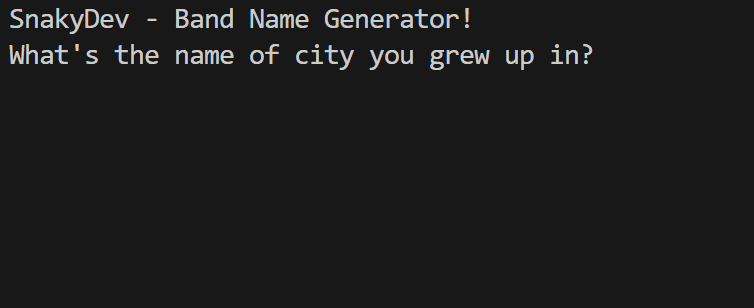

# Day 1 - Working with Variables in Python to Manage Data

## Concepts Practised
- Printing to the Console in Python
- String Manipulation and Code Intelligence
- Debugging
- The Python Input Function
- Python Variables
- Variable Naming

## Created Band Name Generator
## [View Code](main.py)

## 🎥 Demo:
