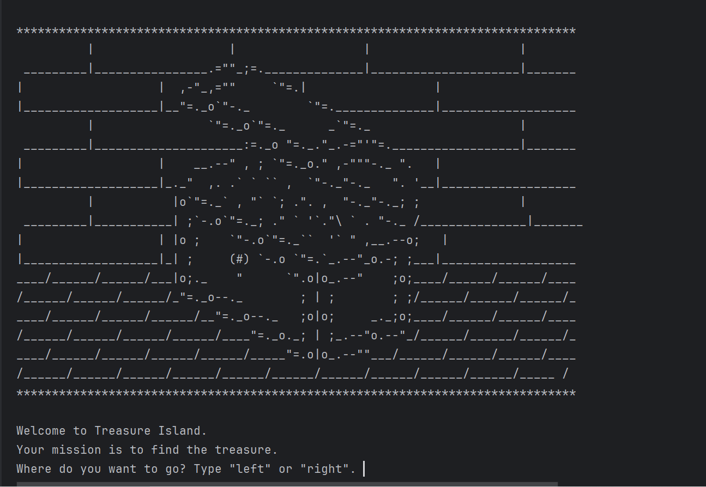

# Day 3 - Control Flow and Logical Operators

## Concepts Practised
- Control Flow with if / else and Conditional Operators
- Modulo Operator
- Nested if statements and elif statements
- Multiple If Statements in Succession
- Logical Operators

## Treasure Island
### [View Code](main.py)
### [Game logic](https://www.draw.io/?lightbox=1&highlight=0000ff&editor=www.draw.io&layers=1&nav=1&title=Treasure%20Island%20Conditional.drawio#Uhttps%3A%2F%2Fdrive.google.com%2Fuc%3Fid%3D1oDe4ehjWZipYRsVfeAx2HyB7LCQ8_Fvi%26export%3Ddownload)

## 🎥 Demo:

